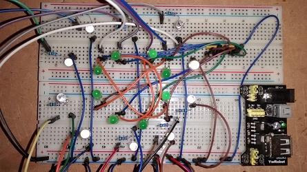
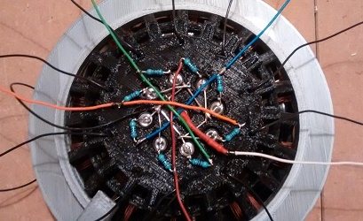
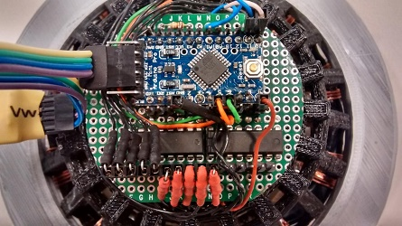
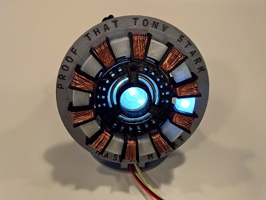

# Welcome to Arc reactor sample

This Arduino project contains a sample/demo application to drive LEDs in a 3D printed "custom case".

In motion :-)
-----------------

Project pictures
-----------------
 | 
------------ | -------------
 | 

File structure
-----------------
Directories:
* Arc_reactor: the Arduino project files
* Pictures
* Schematic: fritzing file folder

Hardware
-----------------
Required components:
* an Arduino Pro Mini 5V
* 2 SN74HC595 shift registers
* LEDs
* Resistors (470 ohm)
* a Bluetooth module (HC-07)

Software
-----------------
To send mode switch commands (key '1' to '4') you can use the serial monitor in the Arduino IDE or any Bluetooth mobile application (like Arduino Bluetooth Control in Google Play Store).

3D model
-----------------
Special thanks to Gyorgy Balassy for his incredible work. :clap:

You can find more informatin on his Thingiverse page: [Tony Stark's Bluetooth Controlled Arc Reactor](http://www.thingiverse.com/thing:2069812)

